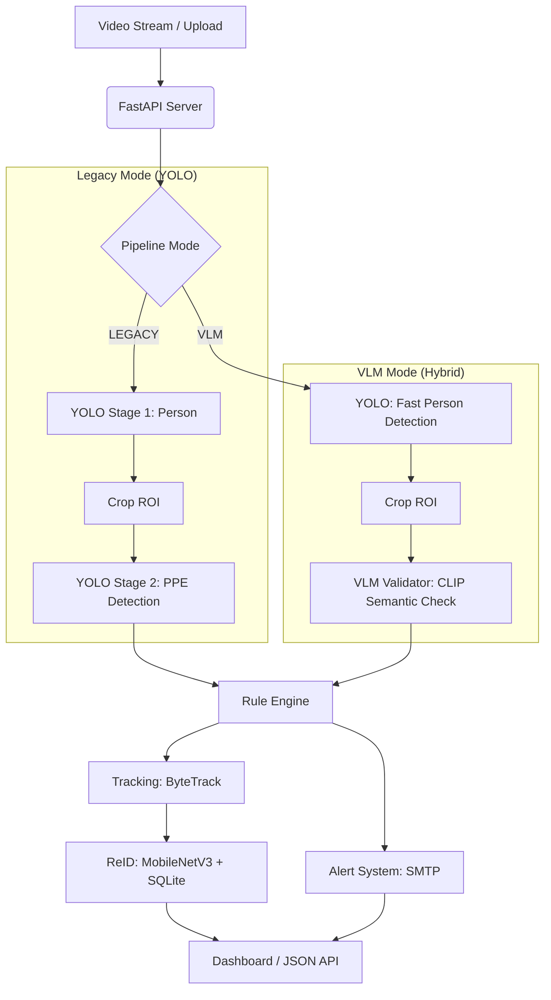

# PPE Detection Synergy Project

A production-grade Personal Protective Equipment (PPE) detection system featuring real-time tracking, persistent cross-video Re-Identification (ReID), and a hybrid AI pipeline combining YOLO speed with VLM accuracy.

## 🚀 Key Features

-   **Hybrid Pipeline Architecture**: Toggle between high-speed Dual-YOLO and zero-shot **VLM (CLIP)** validation.
-   **VLM Validation**: Uses Vision-Language Models (OpenAI CLIP) for high-confidence semantic verification of PPE compliance.
-   **Real-time Tracking**: Integrated **ByteTrack** for consistent frame-to-frame identity persistence.
-   **Persistent Re-Identification (ReID)**: MobileNetV3-based embeddings to recognize individuals across multiple video sessions.
-   **Database Persistence**: SQLite storage for person profiles, embedding history, and compliance logging.
-   **Smart Multi-Stage Alerts**: Stability-aware SMTP alerts that trigger only after sustained violations.

## 🏗️ System Architecture

The project now supports two primary inference modes, configurable via `app/config.py`:



### Core Components

1.  **Detection Pipelines**:
    *   **Legacy**: Uses a cascaded YOLO approach (Full frame → Person Crop → PPE Model).
    *   **VLM**: Uses YOLO for localization and **CLIP (Contrastive Language-Image Pre-training)** for semantic validation of "wearing hardhat/vest".
2.  **Tracking & ReID**:
    *   **ByteTrack**: Maintains frame-level association.
    *   **Embeddings**: 576-dim L2-normalized vectors generated by MobileNetV3.
3.  **State Management**:
    *   **SQL Persistence**: Tracks `global_id` assignments and alert history.
    *   **Violation Buffering**: Implements a time-threshold logic to avoid spamming alerts for transient occlusions.

## 🛠️ Setup & Configuration

### Pipeline Selection
Edit `app/config.py` to choose your preferred architecture:

```python
# app/config.py
PIPELINE_MODE = "VLM"  # "LEGACY" for pure YOLO, "VLM" for Hybrid
VLM_PROMPTS = {
    "hardhat": ["a person wearing a hardhat", "a person without a helmet"],
    "vest": ["a person wearing a safety vest", "a person in normal clothes"]
}
```

### Local Execution
```bash
cd ppe-detection-synergy-project/ppe-detection-app
bash run_local.sh
```

## 📂 Project Structure

```text
ppe-detection-app/
├── app/
│   ├── main.py          # FastAPI application & MJPEG Streamer
│   ├── inference.py     # Main Logic: High-level pipeline controller
│   ├── vlm_validator.py # NEW: CLIP-based VLM validation logic
│   ├── extractor.py     # MobileNetV3 Feature Extraction
│   ├── database.py      # SQLite ReID layer
│   └── config.py        # Mode Toggle (LEGACY/VLM) & Prompts
├── weights/             # YOLOv11/v8 Model Weights
├── static_results/      # Snapshots of detected violations
└── run_local.sh         # Shell script to boot all services
```

## 📊 Available Models

- **best-stage2.pt**: (Recommended) Fine-tuned in 2 stages: 1st stage frozen backbone (9 layers) for 20 epochs, 2nd stage unfreezed all layers for 150 epochs. Best recall so far.
- **best-v1.pt**: Fine-tuned for 150 epochs with 10 layers frozen. Good stability, but lower recall for distance.
- **best-v3.pt**: YOLOv8-based variant.
- **best-v4-freeze9.pt**: Fine-tuned for 150 epochs with 9 layers frozen.
- **best-v2.pt**: Fine-tuned for 150 epochs with 5 layers frozen.

---
*Developed for the IITB-AIMLPractice-Project.*


