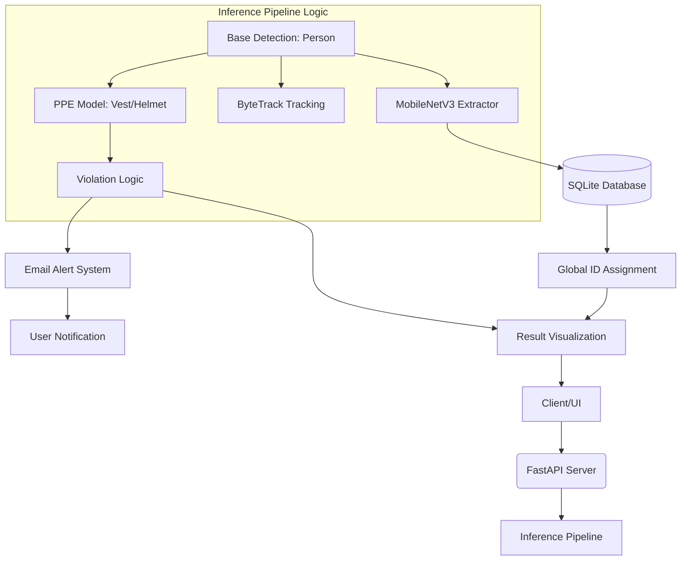

# PPE Detection Synergy Project

A production-grade Personal Protective Equipment (PPE) detection system featuring real-time tracking, persistent cross-video Re-Identification (ReID), and automated safety alerts.

## 🚀 Key Features

-   **Dual-Model Inference**: Optimized detection using a base person detector followed by high-resolution PPE-specific crops.
-   **Real-time Tracking**: Uses **ByteTrack** to maintain identities within a single video session.
-   **Persistent Re-Identification (ReID)**: Extracts visual embeddings using **MobileNetV3** to recognize individuals across different video files and sessions.
-   **Database Persistence**: Local **SQLite** storage for person profiles, including embeddings, visit history, and alert frequency.
-   **Smart Email Alerts**: Automated SMTP alerts with snapshots of violations, featuring stability thresholds to prevent spam.
-   **High-Performance Streaming**: FastAPI-based MJPEG streaming for real-time visualization of tracking and ReID results.

## 🏗️ System Architecture

The latest architecture follows a modular pipeline design:



### Core Components

1.  **AI Models**:
    *   **Base Model**: Primary detection and tracking (YOLO).
    *   **PPE Model**: Specialized fine-tuned model for detecting safety gear (Helmets, Vests, Masks).
    *   **Feature Extractor**: MobileNetV3 generating 576-dimensional L2-normalized embeddings for ReID.
2.  **Tracking & ReID**:
    *   **ByteTrack**: Provides frame-to-frame temporal consistency.
    *   **ReID Logic**: Performs cosine similarity search against the SQLite database to assign a persistent **Global ID** (e.g., `REID:12`).
3.  **Data Layer**:
    *   **SQLite**: Stores `persons` table with binary blobs for embeddings and metadata.
4.  **Alerting**:
    *   **Threshold-based Alerting**: Only triggers emails if a person violates PPE rules for more than `X` seconds, reducing false positives.

## 🛠️ Setup & Installation

### 1. Requirements
-   Python 3.9+
-   `ffmpeg` (for video processing)
-   Environment variables for email alerts (see `.env.example`)

### 2. Installation
```bash
# Clone and enter directory
git clone <repository-url>
cd ppe-detection-synergy-project/ppe-detection-app

# Run the automated setup script
bash run_local.sh
```

### 3. Configuration
Create a `.env` file in the `ppe-detection-app` folder:
```env
EMAIL_USER=your-email@gmail.com
EMAIL_PASS=your-app-password
EMAIL_TO=recipient@example.com
```

## 📂 Project Structure

```text
ppe-detection-app/
├── app/
│   ├── main.py          # FastAPI application & Streaming endpoints
│   ├── inference.py     # Multi-pass YOLO pipeline & Violation logic
│   ├── extractor.py     # MobileNetV3 Person Embedding extractor
│   ├── database.py      # SQLite ReID persistence layer
│   ├── email_utils.py   # Asynchronous SMTP alert handling
│   └── config.py        # System-wide thresholds & Class IDs
├── database/            # stores embeddings.db
├── weights/             # YOLOv8/v11 weight files (.pt)
├── ui/                  # React Lite frontend
├── run_local.sh         # System bootstrapper
└── requirements.txt     # Dependency list
```

## 📊 Available Models

- **best-stage2.pt**: (Recommended) Fine-tuned in 2 stages: 1st stage frozen backbone (9 layers) for 20 epochs, 2nd stage unfreezed all layers for 150 epochs. Best recall so far.
- **best-v1.pt**: Fine-tuned for 150 epochs with 10 layers frozen. Good stability, but lower recall for distance.
- **best-v3.pt**: YOLOv8-based variant.
- **best-v4-freeze9.pt**: Fine-tuned for 150 epochs with 9 layers frozen.
- **best-v2.pt**: Fine-tuned for 150 epochs with 5 layers frozen.

---
*Developed for the IITB-AIMLPractice-Project.*


